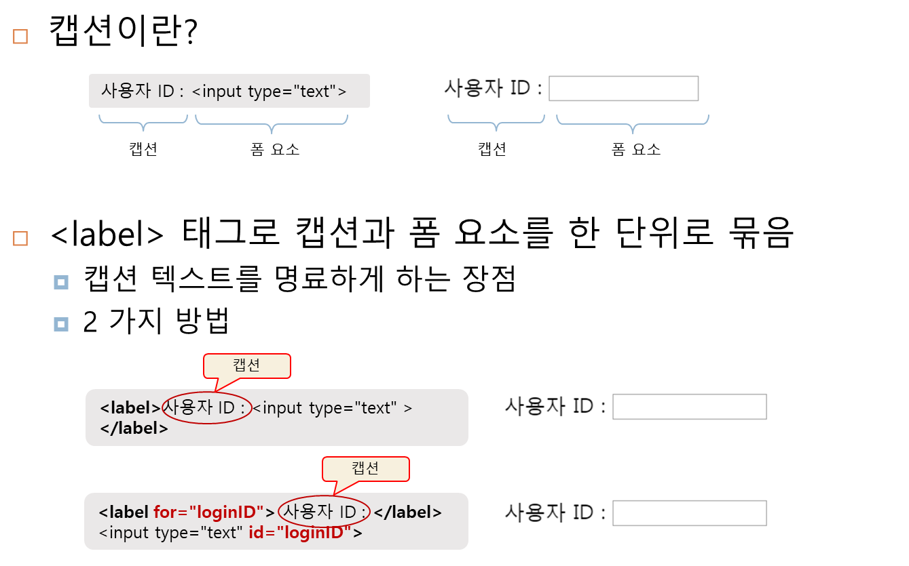
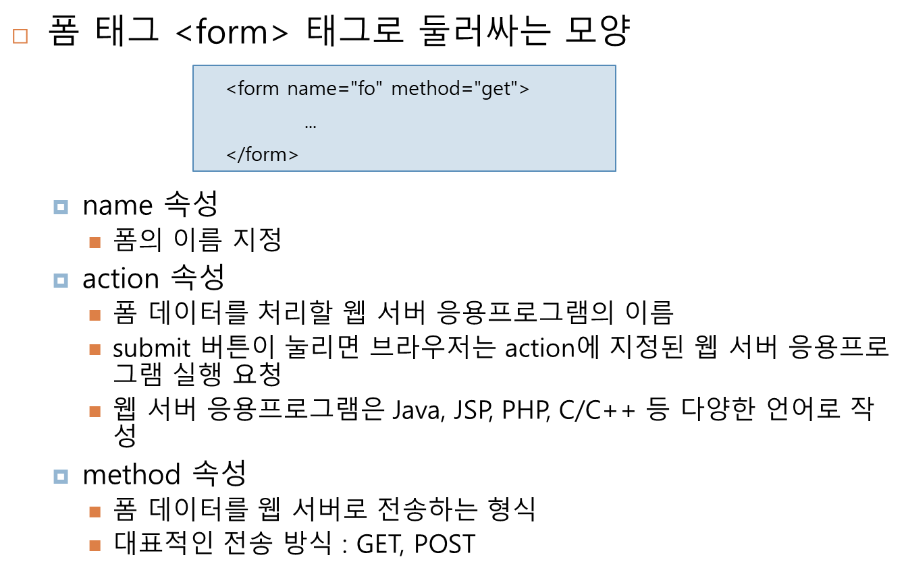
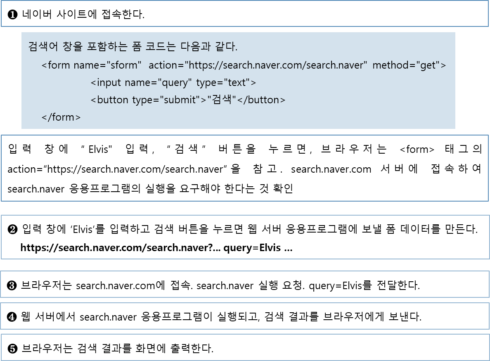
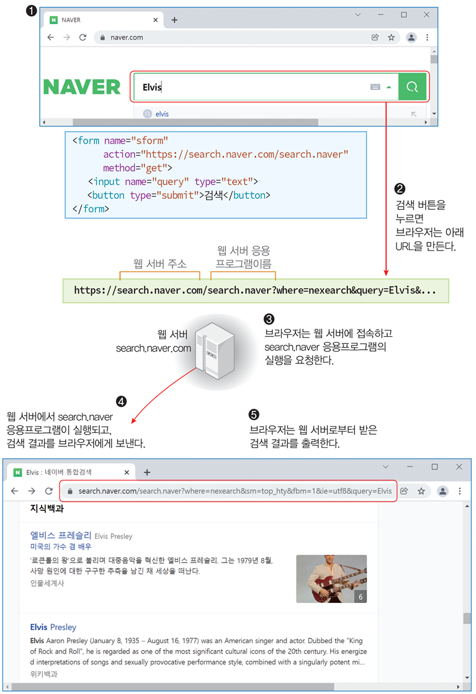

# HTML studying
### Sol A 2022
---

### 기본 문법과 태그

- 텍스트 굵게 표기하기
    (strong) (/strong)    #여기서 ()는 꺽쇠로 표기해야함
- 텍스트 밑줄 긋기
    (u) (/u)

- 글씨 크기
    (h1)(/h1)
    (h2),(/h2)
    이런식으로 표기하는데, 숫자가 커질 수록 글자 크기 감소
    h 태그를 해준 글씨는 그냥 쓴 글씨보다 좀 두껍게 표기됨  

- 줄 바꿈 (br) -> 안닫아줘도 됨.
- 단락 바꿈 (p)(/p)

### 네이버 검색 사례로 폼 전송 과정 이해

=> 약간 이런느낌??
